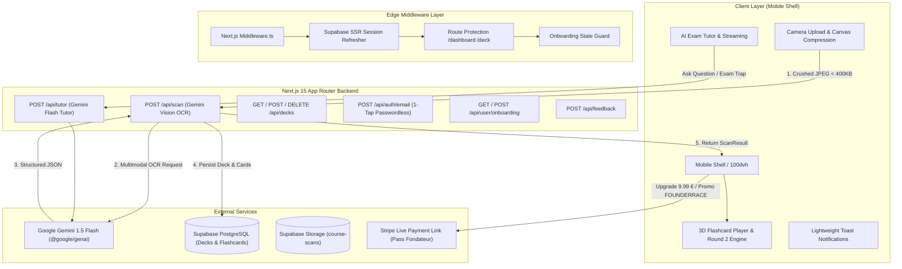

# LORENO  (loreno.app) - Technical Architecture & Engineering Specification

> Comprehensive system design, data flows, AI vision pipelines, middleware security, and fault-tolerance patterns for Loreno.

---

## 1. System Architecture Overview

Loreno is architected as a high-performance, mobile-first Web Application built on Next.js 15 App Router, backed by Supabase (PostgreSQL & Storage) and Google Gemini 1.5 Flash Vision.



---

## 2. Core Engineering Pillars

### 2.1. Client-Side Image Compression (< 400 KB)
- **Problem**: Modern smartphones produce 5MB-15MB photos. Uploading raw files over mobile 4G/3G introduces 4-10s network latency.
- **Solution**: [`lib/image-compression.ts`](file:///home/julien/git/locked-fouder-race/lib/image-compression.ts) intercepts the file, renders it into an off-screen HTML5 Canvas with high-quality bicubic smoothing, downsizes max dimension to 1600px, and encodes to JPEG (0.8 quality).
- **Impact**: File size reduced by **> 90%** (< 400 KB), enabling end-to-end OCR processing under 2 seconds.

### 2.2. Edge Middleware & Route Protection
- **Session Refresher**: [`middleware.ts`](file:///home/julien/git/locked-fouder-race/middleware.ts) and [`lib/supabase/middleware.ts`](file:///home/julien/git/locked-fouder-race/lib/supabase/middleware.ts) refresh Supabase SSR auth cookies on every request.
- **Route Guarding**: Blocks unauthenticated requests to `/dashboard`, `/deck`, and `/protected` with HTTP 307 redirects to `/auth/login?next=...`.
- **Onboarding Flow Guard**: Checks `user_metadata.onboarding_completed`. Redirects unfinished users to `/quiz` and completed users attempting to visit `/quiz` straight to `/dashboard`.

### 2.3. Onboarding Persistence & Auto-Restoration
- **Database Storage**: User onboarding step (1 to 5), goal, level, name, and pain points are synchronized directly to Supabase `auth.users.raw_user_meta_data`.
- **API Endpoints**: [`app/api/user/onboarding/route.ts`](file:///home/julien/git/locked-fouder-race/app/api/user/onboarding/route.ts) provides `GET` and `POST` handlers for real-time progress syncing.
- **Seamless Resume**: When a user reconnects, [`app/quiz/page.tsx`](file:///home/julien/git/locked-fouder-race/app/quiz/page.tsx) restores their exact step and previous selections.

### 2.4. Multi-Tier AI Vision & Fallback Architecture
- **Primary Engine**: Google Gemini 1.5 Flash (`gemini-3.6-flash` via `@google/genai`).
- **Prompt Engineering**: Instructs Gemini to output strictly valid JSON conforming to the `ScanResult` interface (`title`, `subject`, `summary`, `initial_quiz_question`, `flashcards`).
- **Resilience Strategy**: If the Gemini API returns a 429 rate limit or network timeout, [`app/api/scan/route.ts`](file:///home/julien/git/locked-fouder-race/app/api/scan/route.ts) seamlessly degrades to academic fallback data without crashing the UI.

### 2.5. Active Recall & Exam Gamification
- **3D Flashcards**: Flip animation with swipe gestures (Left: "À revoir", Right: "Je sais").
- **Mirror Photo Drawer**: Slide-over drawer displaying the original handwritten note so students can cross-reference raw sources.
- **Round 2 Second Chance**: Isolates failed flashcards at the end of a session and prompts a re-run until 100% mastery.
- **Predictive Exam Score /20**: Converts retention percentage into a realistic French academic grade (e.g. 18/20 Mention Très Bien).

---

## 3. Data Schema & Database Contracts

### 3.1. `decks` Table (PostgreSQL)
```sql
CREATE TABLE public.decks (
    id UUID PRIMARY KEY DEFAULT gen_random_uuid(),
    user_id UUID NOT NULL REFERENCES auth.users(id) ON DELETE CASCADE,
    title TEXT NOT NULL,
    subject TEXT,
    summary TEXT,
    initial_quiz_question TEXT,
    image_url TEXT,
    created_at TIMESTAMPTZ DEFAULT now(),
    updated_at TIMESTAMPTZ DEFAULT now()
);

CREATE INDEX idx_decks_user_id ON public.decks(user_id);
```

### 3.2. `flashcards` Table (PostgreSQL)
```sql
CREATE TABLE public.flashcards (
    id UUID PRIMARY KEY DEFAULT gen_random_uuid(),
    deck_id UUID NOT NULL REFERENCES public.decks(id) ON DELETE CASCADE,
    front TEXT NOT NULL,
    back TEXT NOT NULL,
    order_index INTEGER DEFAULT 0,
    created_at TIMESTAMPTZ DEFAULT now()
);

CREATE INDEX idx_flashcards_deck_id ON public.flashcards(deck_id);
```

---

## 4. API Endpoints Specification

| Method | Endpoint | Description | Auth Required |
| :--- | :--- | :--- | :---: |
| `POST` | `/api/scan` | Multimodal OCR analysis with Gemini 1.5 Flash | Optional (auto-persists if logged in) |
| `POST` | `/api/tutor` | Conversational Exam Tutor with context awareness | Yes / Pro |
| `GET` | `/api/decks` | Fetches all decks and flashcards for authenticated user | Yes |
| `POST` | `/api/decks` | Creates a new deck and child flashcards | Yes |
| `DELETE`| `/api/decks?id=...` | Deletes a deck and cascades to flashcards | Yes |
| `POST` | `/api/auth/email` | 1-Tap Passwordless sign-in / registration via Supabase | No |
| `GET` | `/api/user/onboarding` | Retrieves current user's onboarding step and data | Yes |
| `POST` | `/api/user/onboarding` | Saves user onboarding progress to `user_metadata` | Yes |
| `POST` | `/api/feedback` | User feedback collection with email and Supabase logging | No |

---

## 5. Security & Reliability Practices

1. **Strict TypeScript & Zero `any`**: All data contracts defined in [`types/loreno.ts`](file:///home/julien/git/locked-fouder-race/types/loreno.ts).
2. **Defense in Depth Authentication**: Multi-strategy user resolution checking Supabase Cookies, Bearer Tokens, and JWT Claims.
3. **Safe Storage**: Uploaded course photos stored in Supabase public storage bucket `course-scans/${user.id}/${deckId}.jpg`.
4. **File Size Limit & Code Modularization**: All codebase files strictly under 300 lines for maximum maintainability.
