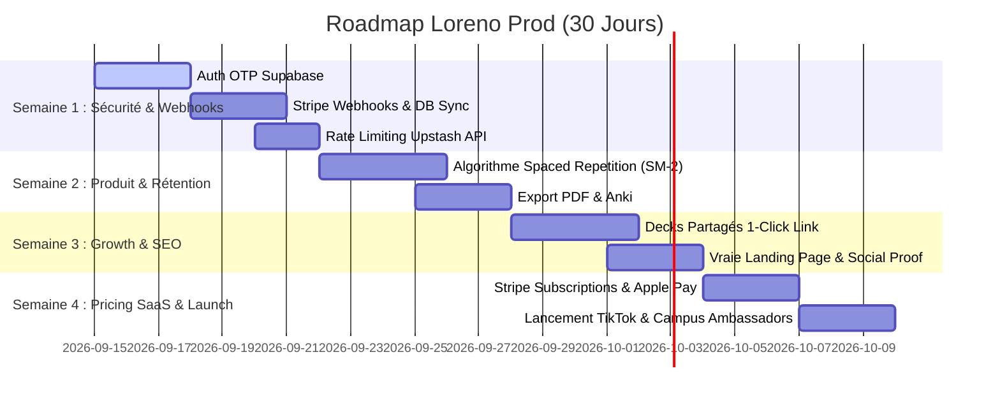

# 🚀 AUDIT COMPLET & ROADMAP PRODUCTION : LORENO (EX-SNAPSTUDY)

> **Document de cadrage CTO & Product** — Passage du prototype gagnant Hackathon à un SaaS EdTech Production-Ready à fort cash-flow.

---

## 📊 Executive Summary & Diagnostic Global

| Axe | Score Actuel | Statut Hackathon | Priorité Vraie Prod |
| :--- | :---: | :--- | :--- |
| **1. Tech & Infrastructure** | **7.5 / 10** | Architecture Next 15 + Supabase + Gemini 3.6 Flash très solide, compression client efficace. | **P0 : Auth OTP & Webhooks Stripe autoritaires** |
| **2. Produit & UX** | **8.0 / 10** | Shell Mobile 100dvh, 3D Flashcards & Effet Miroir très engageants. | **P0 : Algorithme Repetition Spacée (SM-2)** |
| **3. Conversion & Monétisation** | **7.0 / 10** | Paywall agressif & Stripe Payment Link fonctionnels pour du quick cash. | **P0 : Passage Abonnement Récurrent + Apple/Google Pay** |
| **4. Site & Growth / Acquisition** | **4.0 / 10** | Redirection directe onboarding, pas de SEO/Virabilité promo. | **P1 : Decks publics partagés + SEO Matières** |

---

## 🛠️ 1. ARCHITECTURE TECHNIQUE & INFRASTRUCTURE (CTO CHECKLIST)

### 🔴 P0 — Failles Critiques & Refactorings Obliatoires
1. **Sécurisation d'Auth (Remplacement du Hack Email/Password)**
   - *Actuel* : Endpoint `/api/auth/email` générant un mot de passe déterministe/secret local pour connecter l'utilisateur en 1-tap.
   - *Risque* : Contournement d'authentification possible si la clé/méthode est découverte.
   - *Correction Prod* : Passer sur Supabase Email OTP (Magic Link 6 digits) ou Google OAuth natif.
2. **Gestion de l'Abonnement via Webhooks Stripe (Zero Trust Client)**
   - *Actuel* : Statut Pro vérifié via `localStorage`, paramètre `?paid=true` et cookie client `loreno_pro`.
   - *Risque* : N'importe quel étudiant peut ouvrir la console F12 ou ajouter `?pro=true` pour débloquer l'application gratuitement.
   - *Correction Prod* :
     - Implémenter la route `/api/webhooks/stripe` pour écouter `checkout.session.completed` et `customer.subscription.deleted`.
     - Écrire le statut `is_pro` directement dans `auth.users.app_metadata` ou table `profiles` sécurisée par RLS.
     - Vérifier le statut côté serveur dans le Middleware ou les API routes.
3. **Protection des Endpoints & Rate-Limiting (Anti-Billing Spike)**
   - *Actuel* : Routes `/api/scan` et `/api/tutor` directement ouvertes sans rate limit serveur.
   - *Risque* : Risque de facture Google Gemini colossale si scraping ou abus par bot.
   - *Correction Prod* : Intégrer `@upstash/ratelimit` avec Redis pour brider les requêtes (ex: 5 scans/min max par IP/User).

### 🟡 P1 — Scalabilité & Performance Backend
4. **Gestion Asynchrone des Multi-pages & Gros PDF**
   - *Actuel* : Upload synchrone avec Vercel Serverless Functions (limite 4.5 Mo de payload, timeout 15-30s).
   - *Correction Prod* : Pour les PDF de +10 pages, créer une file d'attente (Inngest / QStash) avec Webhooks/WebSockets pour avertir l'utilisateur dès que le deck est généré.
5. **Observabilité & Monitoring**
   - Intégrer **Sentry** (capture d'erreurs runtime) et **PostHog** (product analytics & session replay pour analyser où les étudiants décrochent).

### 🔵 P2 — Socle Technique Vraie Prod (Architecture & Ops CTO)
6. **Politiques RLS Supabase Stricte (Row Level Security)**
   - Vérifier et verrouiller les politiques SQL RLS sur `decks`, `flashcards`, et le bucket storage `course-scans` pour s'assurer que `auth.uid() = user_id` est strictement appliqué en `SELECT`, `INSERT`, `UPDATE`, `DELETE`.
7. **Gestion des Migrations & Supabase CLI**
   - Basculer de l'éditeur SQL manuel du dashboard vers des fichiers de migration versionnés (`supabase/migrations/*.sql`) gérés dans le repo Git.
8. **Conformité RGPD / Privacy (Droit à l'Oubli & Suppression de Compte)**
   - Ajouter un bouton *"Supprimer mon compte"* qui déclenche une suppression en cascade (`DELETE CASCADE`) du profil utilisateur, des decks, des flashcards et de tous ses fichiers scannés dans le Storage Supabase.
   - Ajouter la bannière de consentement cookie pour PostHog / Vercel Analytics.
9. **Pipeline CI/CD & Verification Automated (GitHub Actions)**
   - Configurer un workflow GitHub Actions qui exécute automatiquement `npm run lint`, `tsc --noEmit` (vérification de types TypeScript) et des tests E2E Playwright basiques avant tout merge sur `main`.
10. **Validation Stricte des Entrées API (Zod Schemas)**
    - Valider et assainir (sanitize) les requêtes entrantes sur `/api/scan`, `/api/tutor` et `/api/decks` avec `zod` pour éviter tout Prompt Injection ou injection SQL/NoSQL.
11. **Environnements Staging vs Production**
    - Séparer clairement l'environnement de développement/staging (`staging.loreno.app` avec Supabase test & Stripe test mode) et l'environnement de production en direct.

---

## 📱 2. PRODUIT, ERGONOMIE & RÉTENTION UTILISATEUR

### 🔴 P0 — Le Moteur de Rétention : Repetition Spacée (SRS)
- *Problème* : Actuellement, le swipe des flashcards est éphémère (une session = un récap). L'étudiant ne sait pas **quand** revenir réviser.
- *Solution Prod* : Implémenter une version simplifiée de l'algorithme **SuperMemo-2 (SM-2)** :
  - Boutons de réponse : *À revoir (1 jour)*, *Moyen (3 jours)*, *Facile (7 jours)*.
  - Sauvegarder dans la table `flashcards` : `next_review_at`, `interval`, `ease_factor`, `repetitions`.
  - Dashboard étudiant avec notification : *"34 cartes à réviser aujourd'hui pour garder tes connaissances à 100%"*.

### 🟡 P1 — Fonctionnalités Clés & Correccions UX (Feedback Julien)
1. **Fix UX Tactile Flashcards (Tap 1-Click)**
   - *Bug actuel* : Nécessité d'appuyer longuement pour retourner la carte (interférence gestuelle pointer/drag).
   - *Fix* : Isoler l'événement `onClick` / `onTap` rapide du swipe drag pour un flip instantané à 1-tap.
2. **Visionneuse Multi-Photos dans le Mirror Modal**
   - *Bug actuel* : Seule la 1ère photo du cours scanné est affichée dans la modal miroir.
   - *Fix* : Stocker un tableau d'URLs (`image_urls TEXT[]`) en BDD pour permettre de swiper toutes les photos scannées du cours.
3. **Apprendre / Compléter un Cours Existant**
   - *Feature* : Permettre d'ajouter de nouvelles photos/notes à un cours déjà créé (Append/Merge deck & flashcards).
4. **Fiches de Révision Approfondies (Fiches Structurées)**
   - *Feature* : La synthèse actuelle est trop courte (2-3 phrases). Proposer un bouton *"Générer la Fiche de Révision Complète"* avec grands axes, définitions clés et schémas synthétiques.
5. **Analytics & Tracking (PostHog / Mixpanel)**
   - *Feature* : Suivi précis du tunnel (visites landing -> onboarding -> premier scan -> paywall -> révisions récurrentes).
6. **Exportation 1-Click (Anki, PDF Print, Notion)**
   - Permettre l'exportation des fiches au format `.apkg` (Anki) ou Fiches de révision PDF prêtes à imprimer. (Feature très demandée et valorisable dans un plan Pro).
7. **Mode Hors-Ligne & PWA (Progressive Web App)**
   - Ajouter un Service Worker et Manifest PWA pour installation direct sur écran d'accueil iPhone/Android.
   - Stockage local IndexedDB des decks pour réviser dans les transports sans réseau.
8. **Multi-Source Ingestion**
   - Support d'enregistrement audio (Dictaphone d'amphi) via Whisper / Gemini Audio $\rightarrow$ Flashcards automatiques.

---

## 🌐 3. ACQUISITION, SEO & GROWTH LOOPS

### 🔴 P0 — La Loop Virale Écoles & Promos (Student-to-Student)
- **Partage de Deck Publique (1-Click Link)** :
  - Permettre à un étudiant délégué ou major de promo de scanner un cours et de partager le lien (`loreno.app/d/xyz`).
  - Toute la classe accède au deck en mode consultation avec un banner CTA : *"Scanne tes propres cours avec Loreno"*.
  - Multiplie l'acquisition virale par 10 sans dépenser 1€ en pub.

### 🟡 P1 — Architecture SEO & Landing Page
1. **Séparation Landing Page vs App Router**
   - Remplacer le `app/page.tsx` actuel (qui saute directement dans l'onboarding) par une vraie Landing Page haute conversion.
   - Ajouter des pages d'atterrissage SEO dynamiques par matière / filière :
     - `/reviser/droit-constitutionnel`
     - `/reviser/pass-medecine`
     - `/reviser/prepa-ecole-de-commerce`
2. **Programmes de Parrainage (Referral Loop)**
   - *"Invite 2 potes de ta promo = 1 mois de Pass Pro offert"*.

---

## 💶 4. CONVERSION & MODÈLE FINANCIER (BUSINESS CTO)

### 🔴 P0 — Repenser le Pricing : Du Pass Fondateur à la Récurrence (SaaS)
- *Problème du Pass Fondateur à 9,99€ à vie* : Excellent pour valider le PMF et encaisser du cash pendant un concours, mais toxique financièrement si l'étudiant consomme des API Gemini pendant 3 ans.
- *Grille de Pricing Cible pour la Prod* :

| Plan | Prix | Inclus |
| :--- | :--- | :--- |
| **Freemium** | **0 €** | 3 scans/mois, 50 flashcards max, Spaced repetition basique. |
| **Pass Partiels (Mensuel)** | **6,99 € / mois** | Scans illimités, PDF multi-pages, Tuteur IA illimité, Export Anki. |
| **Pass Annuel (Best Value)** | **39,99 € / an** *(3,33€/mo)* | Inclus tous les avantages + accès prioritaire Gemini 3.6. |
| **Pass Urgence 7 Jours** | **3,99 € / one-shot** | Accès illimité pendant 7 jours avant la semaine de partiels. |

### 🟡 P1 — Friction Checkout & Payment Experience
- **Apple Pay & Google Pay Natifs** :
  - Remplacer le lien externe `buy.stripe.com` par **Stripe Embedded Checkout** ou **Stripe Elements**.
  - Permet le paiement en 1-tap avec FaceID sur iPhone (gain de +25% de conversion sur mobile).

---

## 🎯 ROADMAP D'EXÉCUTION RECOMMANDEE (ACTION PLAN 30 JOURS)

